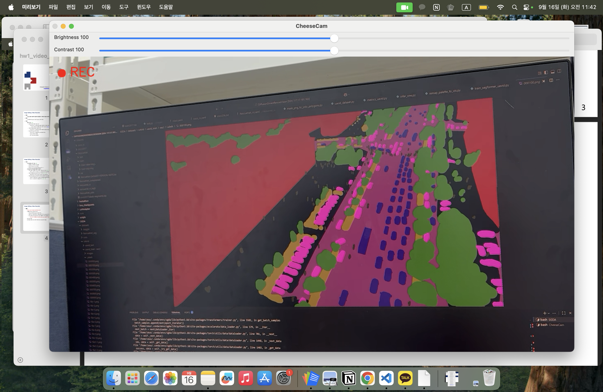
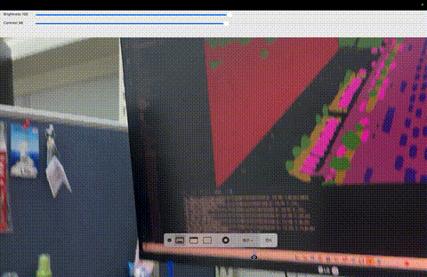

# CheeseCam 🧀

**CheeseCam**은 OpenCV를 이용한 간단한 비디오 녹화기입니다.  
웹캠이나 외부 카메라(예: iPhone Continuity Camera)를 이용해서 실시간 미리보기와 녹화를 지원합니다.

---

## ✨ 프로그램 기능

- 카메라 영상을 실시간으로 화면에 표시
- Space 키로 **Preview ↔ Record** 모드 전환
- Record 모드에서는 빨간 점과 `REC` 표시 및 경과 시간(타이머) 출력
- 녹화된 영상은 실행 폴더에 자동 저장 (`record_YYYYMMDD_HHMMSS.avi / .mp4`)
- ESC 키로 프로그램 종료
- 밝기 / 대비 조절: 슬라이더(Trackbar)로 실시간 조정 가능
- 좌우 반전 (Flip): `f` 키로 화면 좌우 반전
- 코덱 선택: `c` 키로 XVID(avi) ↔ MP4V(mp4) 전환
- 자동 타임스탬프 파일명 생성: 실행 시각 기반으로 파일명이 자동 부여

---

## ⚙️ 실행 방법

### 설치
```bash
pip install opencv-python numpy
````

### 실행

```bash
python main.py
```

### 조작법

* `Space` → 녹화 시작 / 중지
* `ESC` → 종료
* `f` → 좌우 반전 토글
* `c` → 코덱 변경 (avi ↔ mp4)
* 밝기 / 대비 슬라이더 → 화면 보정

---

## 📸 실행 화면

| Preview 모드                           | Record 모드                          |
| ------------------------------------ | ---------------------------------- |
|  |  |

---

## 🎬 데모

> 

---

## 📝 비고

* macOS: `cv2.CAP_AVFOUNDATION` 사용 권장
* Linux: `cv2.CAP_V4L2`
* Windows: `cv2.CAP_DSHOW`
* 카메라 장치가 여러 개일 경우 index(0, 1, 2...)를 바꿔 시도해야 할 수 있음

---
